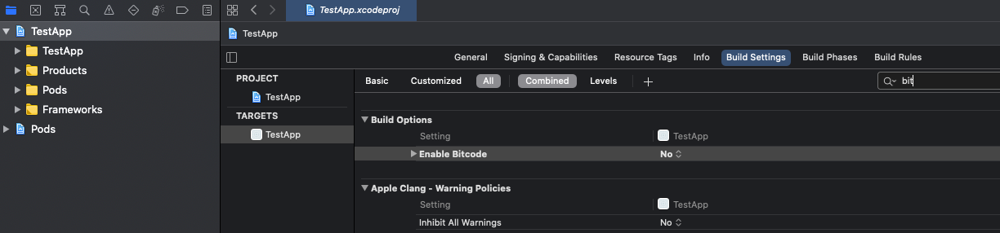

# Ziggeo's ReactNative SDK

## Index

1. [Why Ziggeo's ReactNative SDK?](#why-us)
2. [Prerequisites](#prerequisites)
	1. [Download](#download)
	2. [Dependencies](#dependencies)
	3. [Install](#install)
		1. [Android](#install-android)
		2. [iOS](#install-ios)
3. [Demo](#demo)
4. [Codes](#codes)
	1. [Init](#init)
	2. [Recorder](#recorder)
		1. [Video Camera Recorder](#video-recorder)
		2. [Video Screen Recorder](#screen-recorder)
		3. [Audio Recorder](#audio-recorder)
		3. [Image Capture](#image-capture)
		4. [Uploader](#upload-recorder)
	3. [Player](#player)
		1. [Video Player](#video-player)
		2. [Audio Player](#audio-player)
		2. [Image Preview](#image-preview)
	4. [QR Scanner](#qr-scanner)
	5. [Configs](#configs)
		1. [Theming](#theming)
		2. [Recorder Configs](#recorder-config)
		2. [Player Configs](#player-config)
	6. [Events / Callbacks](#events)
		1. [Global Callbacks](#callbacks-global)
		2. [Recorder Callbacks](#callbacks-recorder)
		3. [Player Callbacks](#callbacks-player)
		4. [Sensor Callbacks](#callbacks-sensor)
	7. [API](#api)
		1. [Request Cancellation](#api-cancel)
		2. [Videos API](#api-videos)
		3. [Video Streams API](#api-video-streams)
	8. [Authentication](#authentication)
		1. [Client Side Auth](#authentication-client)
		2 .[Server Side Auth](#authentication-server)
5. [Compiling and Publishing App](#compile)
6. [Update Information](#update)
7. [Changelog](#changelog)


## Why Ziggeo's ReactNative SDK? <a name="why-us"></a>

Ziggeo is powerfull whitelabel video SAAS that helps people be part and lead the video revolution. It has award winning multimedia API and its CEO and CTO can often be seen talking in various events around the world.

Ziggeo's ReactNative SDK is utilizing the API to bring you a native library you can add to your project. Just add to project and allow your application evolve into something much more, something video!

It offers you pre-built functionality to call and manipulate. This library also offers you direct access to the Ziggeo API as well if you want to do more things yourself.

### Who it is for?

Do you have a complex ReactNative app that is missing that one key ingredient - the video?

Do you need a video library that can be seamlesly integrated into your existing app?

Want something that is simple and easy to use?

You need some powerful features high end video apps provide?

Want to provide a great video experience for your own customers?

If any of the above is "Yes" then you are in the right place as this SDK is for you!

### Other Mobile SDKs

Did you know that Ziggeo offers several different SDKs for you to choose from? You can see all of our mobile SDKs [within our docs](https://ziggeo.com/docs/sdks/mobile/).

## Prerequisites <a name="prerequisites"></a>

### Download <a name="download"></a>

You will want to either download the SDK zip file or to pull it in as git repository into your own project.

### Dependencies<a name="dependencies"></a>

Please use latest build tools and SDK version when compiling.

For iOS you will also need to download frameworks. Please refer to the installation part if you will be using our SDK for iOS apps.

### Install<a name="install"></a>

There are several options when it comes to adding Ziggeo to your mobile apps. We will cover points for both Android and iOS bellow.

#### Android<a name="install-android"></a>

You can start using Ziggeo by utilizing automatic install steps, or by going through manual install steps. Both however have few steps in common as requirement.

These are the current values:

compileSdkVersion = `31`
targetSdkVersion = `31`
minSdkVersion >= `21`
buildToolsVersion = `30.0.3`

##### Installing for Android Manually

1. Modify `android/settings.gradle` by appending the following lines:

```
include ':react-native-ziggeo-library'
project(':react-native-ziggeo-library').projectDir = new File(rootProject.projectDir, 	'../node_modules/react-native-ziggeo-library/android')
```

2. Modify `android/build.gradle` by adding the following line inside the `allprojects/repositories` block:

```
maven { url 'https://jitpack.io' }
```

3. Modify `android/app/build.gradle` by setting the correct versions of:
	a) `compileSdkVersion`
	b) `targetSdkVersion`
	c) `minSdkVersion`
	e) `buildToolsVersion`
	f) all libs from `com.android.support` package

- Note: See above the [correct values](#install-android) you should use.

In the same file also insert the following line inside the `dependencies` block:  

```
implementation project(':react-native-ziggeo-library')
```

4. Modify `android/app/AndroidManifest.xml` by adding the following line inside the `manifest` block:

```
xmlns:tools="http://schemas.android.com/tools"
```

Also insert the following line inside the `application` block:

```
tools:replace="android:name"
```

5. Modify `android/app/src/main/java/[...]/MainApplication.java`:
- Add `import com.ziggeo.ZiggeoPackage;` to the imports at the top of the file below `package`
- Add `new ZiggeoPackage()` to the list returned by the `getPackages()` method

##### Installing for Android Automatically

This will require few manual steps, however most will be set for you by running the following console calls:

```
$ npm install react-native-ziggeo-library --save
$ react-native link
```

After this is done, you will need to:

1. Modify `android/build.gradle` by adding the following line inside the `allprojects/repositories` block:

```
maven { url 'https://jitpack.io' }
```

2. Modify `android/app/build.gradle` by setting the correct versions of:
	a) `compileSdkVersion`
	b) `targetSdkVersion`
	c) `minSdkVersion`
	e) `buildToolsVersion`
	f) all libs from `com.android.support` package

- Note: See above the [correct values](#install-android) you should use.

#### iOS<a name="install-ios"></a>

iOS can be installed in 2 different ways. You can run few calls through console and set things up, or if you are using pod files, you can utilize that for quicker installation.

- Note: Sometimes iOS project compilation may raise analyzer issues. Use these commands to clean and build the project from scratch:

```
$ cd ios
$ rm -rf build
$ xcodebuild clean
```

##### iOS installation using pods

Add these lines to your Podfile and run 'pod install'
```
	pod 'ZiggeoMediaSDK', :git => 'https://github.com/Ziggeo/iOS-Client-SDK.git'
```

##### Installing for iOS Manually

To do this, you would need to run following console calls:

```
$ npm install react-native-ziggeo-library --save
$ react-native link
```

Following this there are few more steps you would need to do:

1. You should download `ZiggeoMediaSDK.framework` from `iOS-Client-SDK` repository: https://github.com/Ziggeo/iOS-Client-SDK/tree/master/Frameworks/.

- note: There are two framework versions: release and universal. Use universal framework for development and debugging purposes and switch to Release framework to build the application for App Store

2. open the iOS project in XCode and add the `ZiggeoMediaSDK.framework` into `Embedded and Linked Frameworks` at the project settings

## Demo<a name="demo"></a>

For those that like to start off with a demo, you can simply go to [demo repo](https://github.com/Ziggeo/ReactNativeDemo) and follow the steps found in the readme file of the demo.

## Codes<a name="codes"></a>

This section will introduce you to the most common ways you would integrate our video library into your app.

### Init<a name="init"></a>

```javascript
import Ziggeo from 'react-native-ziggeo-library';

Ziggeo.setAppToken('APP_TOKEN');
```
- You can grab your appToken by logging [into your](https://ziggeo.com/signin) account and under application you will use > Overview you will see the app token.

### Recorder<a name="recorder"></a>

Ziggeo supports different media formats and offers multiple recorder options for you.
1. Video Camera Recorder
2. Video Screen Recorder
3. Audio Recorder
4. Image Capture (Snapshot Recorder)

Each will be showcased within its own section bellow.

- See [Configs](#configs) section bellow to see how to configure the recorder with more specific options, instead of using defaults

#### Video (Camera) Recorder<a name="video-recorder"></a>

To have your app capture video content from the camera, all you need is to use the following

```javascript
Ziggeo.record();
```

You can also use:
```javascript
Ziggeo.startCameraRecorder();
```

- Note: Both functions call the same endpoint.

#### Video (Screen) Recorder<a name="screen-recorder"></a>

By utilizing the following you will be creating a foreground service for screen recording

##### Android
```javascript
Ziggeo.startScreenRecorder();
```
##### iOS
```javascript
Ziggeo.startScreenRecorder("YOUR_APP_GROUP_NAME", "Preferred_Extension_Name");
```

#### Audio Recorder<a name="audio-recorder"></a>

Audio Recorder is perfect when you want to capture the content that does not show the face or any imaging, focusing only on the audio aspect of the capture.

```javascript
Ziggeo.startAudioRecorder();
```

#### Image Capture<a name="image-capture"></a>

```javascript
Ziggeo.startImageRecorder();
```

#### Uploading <a name="upload-recorder"></a>

Sometimes you might want to upload something instead of showing the recorder. With the above, you can do the same.

**Upload From Path**

```javascript
Ziggeo.uploadFromPath(fileName, createObject: CreateObject)
```

**Upload using File Selector**

```javascript
Ziggeo.uploadFromFileSelector(argsMap);
```

### Player<a name="player"></a>

Capturing different types of media expects support for playback of the same. As such Ziggeo has a player for different type of media you might capture and use within your apps.

Ziggeo provides to following player:
1. Video Player
2. Audio Player

Each will be showcased within its own section bellow.

#### Video Player<a name="video-player"></a>

Player can be used to play local videos, videos from other services and of course videos from Ziggeo servers.

**Standard Playback**

```javascript
Ziggeo.playVideo("VIDEO_TOKEN");
```

**Playback from third-party source**

```javascript
Ziggeo.playFromUri("PATH_OR_URL");
```

#### Audio Player<a name="audio-player"></a>

```javascript
Ziggeo.startAudioPlayer("AUDIO_TOKEN");
```

#### Image Preview<a name="image-preview"></a>

```javascript
Ziggeo.showImage("IMAGE_TOKEN");
```

### QR Scanner<a name="qr-scanner"></a>

QR Scanner makes it easy for your code to retrieve data from the captured QR code.

```javascript
Ziggeo.startQrScanner(data);
```

### Configs<a name="configs"></a>

Each embeddings (players and recorders) has default config and often a config you can set a bit differently if you wanted to.

This section will show you various options at your disposal.

#### Theming<a name="theming"></a>

Similar calls would be made for player as well as for the recorder. You can see available options bellow.

**Recorder**

```javascript
Ziggeo.setThemeArgsForRecorder({hideRecorderControls: true});
```

**Player**

```javascript
Ziggeo.setThemeArgsForPlayer({hidePlayerControls: true});
```

#### Recorder Config<a name="recorder-config"></a>

For uploading we are utilizing a helper config, while other parameters can be set up as they are needed.

```javascript
Ziggeo.setUploadingConfig();
```

**Set max duration**

The duration of the recording is always set as endless, meaning there is no limit in how long your video or audio recording can be. The value for this is 0.

If you set it up with 30 this would be equal to 30 seconds of recording, after which the recording will be automatically stopped.

- When set, this time will also be used in the elapsed time indicator at the top-right corner.
- Note: Duration is in seconds.

```javascript
Ziggeo.setMaxRecordingDuration(30);
```

**Set countdown time**

When camera capture is started, the person might not be ready or might need to adjust the device before they are ready for capture. By default our recorder offers 3 seconds before the actual recording starts.

- Note: If you set it to 0, the person recording themselves might need to turn their phone, flip camera, or to align themselves first before they would actually start so we suggest keeping it somewhere within 2-5 seconds.

```javascript
Ziggeo.setStartDelay(3);
```

**Auto start recorder**

By default the recorder will show an option to start recording process. This is usually the preferred way for most use cases. In some use cases you might prefer that the recorder starts as soon as it is loaded up within the app. In such cases you can set the the following as true.

- Note: You might also want to check out `setStartDelay` as well.

```javascript
Ziggeo.setAutostartRecordingAfter(0);
```

**Set which camera you prefer**

This option allows you to select which camera should be used for recording. By default the back camera is used, however you can change it with this option.

- Note: You can choose `Ziggeo.FRONT_CAMERA` or `Ziggeo.REAR_CAMERA`

```javascript
Ziggeo.setCamera(Ziggeo.REAR_CAMERA);
```

**Set the quality of recording**

Set the quality that you want to use for your video recording. Usually the higher the quality, the better, however in some specific usecases where quality is not as important you could use this option to change it.

- Note: You can choose `Ziggeo.HIGH_QUALITY`, `Ziggeo.MEDIUM_QUALITY` and `Ziggeo.LOW_QUALITY`.

```javascript
Ziggeo.setQuality(Ziggeo.HIGH_QUALITY);
```

**Forbid camera switch during recording**

By default we allow the camera to be switched within the recorder. Sometimes this might not be desirable, and if so you can forbid the ability to switch by setting this to true.

```javascript
Ziggeo.setCameraSwitchEnabled(true);
```

**Submit videos immediately**

By default all videos are immediately sent to our servers. This allows them to be processed and to go through all of the workflows that you have set.
In some cases, you might want to show you button to confirm the video before it is sent or any other action you prefer, in which case you can delay this action.

```javascript
Ziggeo.setSendImmediately(true);
```

**Streaming Recording**

Streaming recording mode will upload the video stream during the recording without caching to local file first. Video preview and video re-record are not available in this mode.

```javascript
Ziggeo.setLiveStreamingEnabled(true);
```

**Enable Cover Selector Dialog**

This will allow you to change if the cover (Snapshot / Image / Poster) selection is shown or not.

```javascript
Ziggeo.setCoverSelectorEnabled(true);
```

**Set Video Width**

If you want to set the resolution of the video, you would need to specify the width and height of the video. This will help you set the width. Please check `setVideoHeight` as well.

```javascript
Ziggeo.setVideoWidth(1920);
```

**Set Video Height**

If you want to set the resolution of the video, you would need to specify the width and height of the video. This will help you set the height. Please check `setVideoWidth` as well.

```javascript
Ziggeo.setVideoHeight(1080);
```

**Set Video Bitrate**

Setting video bitrate allows you to set specific bitrate that you want to have of your video.

- Note: Higher the bitrate, better the quality. The quality in turn will make the end video file be larger as well. Likewise smaller bitrate will result in smaller file footprint, however the visual data will show it.
- Note: bitrate is expressed in bytes

```javascript
Ziggeo.setVideoBitrate(1024 * 1024 * 2);
```

**Set Audio Bitrate**

Setting audio bitrate allows you to set up the quality of the audio captured. Higher the bitrate more data will be captured for single point in time. Lower the bitrate, lowever the quality will be, as well as file size.

- Note: bitrate is expressed in bytes

```javascript
Ziggeo.setAudioBitrate(128 * 1024);
```

**Set Audio Sample Rate**

Setting sample rate allows you to fine tune how many times per second we sample the mic information and save it as audio capture. We suggest leaving at 44100 for audio and 48000 for video if you want to set this manually.

```javascript
Ziggeo.setAudioSampleRate(44100);
```

**Set Blur Mode**

Sets the blur mode for the recorder, blurring out the background behind the person recording themselves.

```javascript
Ziggeo.setBlurMode(true);
```

**Set Extra Arguments**

This can be used to specify effect profiles, video profiles, custom data, tags, etc.

```javascript
var args = { tags: 'react-native' };

Ziggeo.setExtraArgsForRecorder(args);
```

##### Extra arguments examples

**Working with Custom Data**

Custom data is set with extraArgs and represents a JSON Object as string. This custom-data can be anything that you want to attach to the media you are recording or uploading.

```javascript
var args = { data: '{"source":"app"}' };

Ziggeo.setExtraArgsForRecorder(args);
```

**Applying Effect Profile**

If you would like to add your logo or apply some effect to every video that you record or upload, you will want to use effect profiles. They can be used by specifying the effect profile token or key.

- Note: If you are using effect profile key, please add `_` (underscore) before the name, even if the name has underscore within it (the first underscore is removed to match the key you are specifying).

```javascript
var args = { effect_profile: '1234567890' };

Ziggeo.setExtraArgsForRecorder(args);
```

**Set Video Profile**

Video profiles allow you to create video in various resolutions of interest. For example if you want to upload a 1080p video and want to have its versions available in SD format as well, this would be the way to do it.

You can add the video profile token by adding video profile token or video profile key.

- Note: If you are using video profile key, please add `_` (underscore) before the name, even if the name has underscore within it (the first underscore is removed to match the key you are specifying).

```javascript
var args = { video_profile: '1234567890' };

Ziggeo.setExtraArgsForRecorder(args);
```

- Note: All recorders are using the same config class described above.

#### Player Config<a name="player-config"></a>

**Set Extra Arguments**

This can be used to specify effect profiles, video profiles, custom data, tags, etc.

```javascript
Ziggeo.setExtraArgsForPlayer({});
```

**Set Player Cache Config**

If you want to modify the caching config, you should use the PlayerCacheConfig

```javascript
Ziggeo.setPlayerCacheConfig({});
```

**Set Ads Url**

If you want to have the player show adds utilizing VAST, you can specify the link to your VAST manifest here. 

```javascript
Ziggeo.setAdsURL("ADS_URL");
```

### Events / Callbacks<a name="events"></a>

Callbacks allow you to know when something happens. They fire in case of some event happening, such as if error occurs. This way you can design your app to fine detail and be able to provide you customers with great experience.

We have separated the events that are available to you into several different categories.

The callbacks are provided through few different emitters: `recorderEmitter`, `cameraViewEmitter` and `videoViewEmitter`.

#### Global Callbacks<a name="callbacks-global"></a>

Global callbacks happen for both player and recorder. It usually does not depend on the embed method you have used, however each callback has additional details next to it.

**Error**

Ups, something unexpected happened! Now it's your time to react.

The following callback is called at any point in time when some error happens. It will also provide you with throwable parameter.

```javascript
error(data);
```

**Loaded**

The embedding (player, recorder) is loaded up for the very first time after it was created

```javascript
loaded();
```

#### Recorder Callbacks<a name="callbacks-recorder"></a>

The callbacks in this section are specific to recorder only. This means that they will not fire at all for the player embeds.

The callbacks are listed in the order that they should appear in within your code.

- Note: Some callbacks might not be called. For example if video is uploaded and not recorded, recording specific callbacks will never fire.

**Permissions**

If you want to know if the needed access was provided, the following callbacks will help you with the same.

```javascript
recorderEmitter.addListener('accessGranted', data =>
	console.log('accessGranted'),
);
```

```javascript
recorderEmitter.addListener('accessForbidden', data =>
	console.log('accessForbidden'),
);
```

**Camera availability**

Sometimes you might want to know that there is/are camera(s) available. This callback will fire to let you know if there are cameras or if there are none.

```javascript
recorderEmitter.addListener('HasCamera', data =>
	console.log('HasCamera'),
);
```

Just like that, you can also check if it does not have camera

```javascript
recorderEmitter.addListener('NoCamera', data =>
	console.log('NoCamera'),
);
```

**Microphone availability**

Most devices will have microphone available. It could however happen that it is not available, or that it is completely disconnected.

- Note: You will need to check the argument if there is mic detected (true) or not (false).


```javascript
recorderEmitter.addListener('hasMicrophone', data =>
	console.log('hasMicrophone'),
);
```

Just like that, you can also check if it does not have camera

```javascript
recorderEmitter.addListener('noMicrophone', data =>
	console.log('noMicrophone'),
);
```

**Ready to record**

In most cases, once permissions are given, the recording can start and as such this callback will fire. It means that camera is ready and that all permissions are granted. All that is left is to start recording.

```javascript
recorderEmitter.addListener('readyToRecord', data =>
	console.log('readyToRecord'),
);
```

**Countdown to recording**

If you want to know when the countdown is shown, this event will be useful. It will be raised during countdown and right before the `recordingStarted` event.

- Note: The timeLeft will provide you with the seconds as they are shown on screen.

```javascript
recorderEmitter.addListener('countdown', data =>
	console.log('countdown'),
);
```

**Recording has started**

This event fires once recording has just started. This is useful if you want to know that the video was recording and not upload since upload events will fire for all.

It can also be useful if you are using embedded recorder and you want to stop all other activities and bring more focus to the capture.

Standard Recording

```javascript
recorderEmitter.addListener('recordingStarted', data =>
	console.log('recordingStarted'),
);
```

Streaming Recording

```javascript
recorderEmitter.addListener('streamingStarted', data =>
	console.log('streamingStarted'),
);
```

- Note: Streaming is when recording is sent to Ziggeo servers as soon as recording happens. You need to turn this feature on to be utilized.

**Recording in progress**

This event is raised when recording is in process. This is a continuous update notification that will fire through entire duration of recording process.

- Note: `seconds` parameter will let you know how much time has passed since the recording had started.

```javascript
recorderEmitter.addListener('recordingProgress', data =>
	console.log('recordingProgress'),
);
```

**Recording cancelled**

Want to detect if someone cancels the recording? Use this event to know when someone cancelled the recording and closed the screen.

```javascript
recorderEmitter.addListener('canceledByUser', data =>
	console.log('canceledByUser'),
);
```

**Recording Finished**

This event will be raised when recording had just finished. It will happen in cases when the end user clicks on Stop button as well as if there was duration or size limit that was reached.

Standard recording

```javascript
recorderEmitter.addListener('recordingStopped', data =>
	console.log('recordingStopped'),
);
```

Streaming Recording

```javascript
recorderEmitter.addListener('streamingStopped', data =>
	console.log('streamingStopped'),
);
```

**Confirm Recording**

Need to make sure someone confirms the video submission? Use this callback and record its action on your side as you like.

As this might be a requirement in some countries you are utilizing your app, you can easily use this for any sort of confirmation of captured video.

- Note: Our code only fires this event. It is up to you to then use this event to capture and save that someone confirmed the use of the video and in what way. This is done so as it offers you most flexibility in what you want to do and how.

```javascript
recorderEmitter.addListener('manuallySubmitted', data =>
	console.log('manuallySubmitted'),
);
```

**Re-Recording**

Rerecording is a common way to provide the end user of capturing multiple samples before they have one that they are satisfied with to submit.

```javascript
recorderEmitter.addListener('rerecord', data =>
	console.log('rerecord'),
);
```

**Uploading selected**

When the end-user picks a file utilizing file picker to upload to your app, this event will fire to let you know that file is selected.

```javascript
recorderEmitter.addListener('uploadSelected', data =>
	console.log('uploadSelected'),
);
```

**Uploading started**

Want to know when upload starts? In that case you will want to listen to this event. It will be raised every time uploads start to happen.

```javascript
recorderEmitter.addListener('uploadingStarted', data =>
	console.log('uploadingStarted'),
);
```

**Upload progress**

Do you want to know the progress of the uploads? This event will be continuously raised as the uploaded data changes, allowing you to track the progress of every upload.  

```javascript
recorderEmitter.addListener('uploadProgress', data =>
	console.log('uploadProgress'),
);
```

- Note: Please note that during the upload progress you can always stop the upload by calling `cancelUpload` as per following:

```javascript
Ziggeo.cancelCurrentUpload(true);
```

**Upload finished**

Want to know once upload finishes? Then you would want to listen to this event. Our SDK will raise it once all uploading is complete.

```javascript
recorderEmitter.addListener('uploaded', data =>
	console.log('uploaded'),
);
```

**Media Verified**

Do you want to know if the media just uploaded can be processed? In most cases this is true, however in rare cases, it might not be possible.

This utilizes our quick check algorithm to inspect the media before it is sent to processing to see that it can actually be processed. This allows you to react if something is wrong with the media, before the processing stages. It also offers you a way to skip the processing stages, since once verified client side code can do anything, even if not related to the media.

```javascript
recorderEmitter.addListener('verified', data =>
	console.log('verified'),
);
```

**Processing**

While we do not offer an insight into how much of the media was processed, we can tell you how long it is going for. This event will be raised for the entire duration of media processing.

```javascript
recorderEmitter.addListener('processing', data =>
	console.log('processing'),
);
```

**Processing Finished**

Interested in knowing when the media is successfully processed? Listening for this event will allow you to know just that. As soon as it fires, the media is available for playback

```javascript
recorderEmitter.addListener('processed', data =>
	console.log('processed'),
);
```

#### Player Callbacks<a name="callbacks-player"></a>

We differentiate between player and the player shown automatically immediately after recording. You will find events for both types here.

**Media playback available**

Want to know once the player can play the video? This event will let you know once the media is available for playback. By listening to it, you can avoid listening to progress events as it will fire once the media is ready regardless if it has to be processed first, or if it is waiting to download the media to make it available for playback

```javascript
videoViewEmitter.addListener('readyToPlay', data =>
	console.log('readyToPlay'),
);
```

**Playback started**

Want to react when playback is started? This event will be raised every time the playback is started.

```javascript
videoViewEmitter.addListener('playing', data =>
	console.log('playing'),
);
```

**Playback paused**

What to react when someone pause's the video?. This event will be raised when the Pause button is clicked.

- Note: It will also fire at the end of the video

```javascript
videoViewEmitter.addListener('paused', data =>
	console.log('paused'),
);
```

**Playback Ended**

Want to know when the media playback ends? This event will be raised any time the playback reaches the end of media length.

```javascript
videoViewEmitter.addListener('ended', data =>
	console.log('ended'),
);
```

**Playback seeking**

Want to know if and where to someone changes the point of playback (seeks the media)? This event will be raised when the person watching the media moves the player's progress indicator to a new position. This will fire for both going forward as well as going back in playback.

- Note: The value returned will be milliseconds of time when seek operation was set to, looking from the start.

```javascript
videoViewEmitter.addListener('seek', data =>
	console.log('seek'),
);
```

#### Sensor Callbacks<a name="callbacks-sensor"></a>

**Lightning conditions**

* Not available at this time

**Microphone levels**

Are you interested in knowing microphone health status? This event will be raised every second with the information about the recorder amplitude.

```javascript
videoViewEmitter.addListener('microphoneHealth', data =>
	console.log('microphoneHealth'),
);
```

### API<a name="api"></a>

Our API is split into unique segments. The main one is videos. This deals with the video and videos as a whole.

Now as each video can have streams (sub videos) we also have an API that can deal with each stream as well.

For example, removing a video will remove all of its streams. On the other hand when removing a single stream, the rest of streams and the video itself will stay available. Of course, except that one stream.

Ziggeo also has APIs for other nodes, however there is a difference in API features available for client vs server side SDKs. The client side SDK calls, are safe to be called from app, while server side SDKs and their calls should only be used on server side and then passed over to your app.

If you have any questions about the specifics, do reach out to our [support team](mailto:suppport@ziggeo.com)

#### Request Cancellation<a name="api-cancel"></a>

API calls are usually made for specific action, however often, this is driven by the end user selection and they might at times change their mind. To be able to do that, you need to be able to cancel the request.

A good example of such case is if your customer realizes that they have selected a wrong video to upload.

```javascript
Ziggeo.cancelCurrentUpload(true);
```

or

```javascript
Ziggeo.cancelUploadByPath(path_str, true);
```

#### Videos API<a name="api-videos"></a>

**Find videos**

A way to find the videos based on your query and show them off. By default it is 50, however it can return back up to 100 videos at a time. Pagination control is also present.

- Note: For each call the videos will be returned from the newest first (by default).

```javascript
/**
	* @param args  - limit: Limit the number of returned videos. Can be set up to 100.
	*              - skip: Skip the first [n] entries.
	*              - reverse: Reverse the order in which videos are returned.
	*              - states: Filter videos by state
	*              - tags: Filter the search result to certain tags
	*/
await Ziggeo.VideosApi.index(args);
```

**Get video info**

A way for you to get info about the specific video, utilizing its video token or key.

- Note: Keys have to start with underscore, regardless of if they have it in their name already or not.

```javascript
/**
	* @param keyOrToken - video token or key.
	*/
await Ziggeo.VideosApi.get(keyOrToken);
```

**Create a video**

If you have video uploading code that you can not remove right away, however want to utilize Ziggeo, you could make a call to the video create API instead. That way your existing codes are used to create a new video in your Ziggeo app.

- Note: When setting a key, you do not need to include underscore as prefix. Even if you do, you will still need to include one in other calls.

```javascript
/**
	* @param file  - Video file to be uploaded
	* @param args  - min_duration: Minimal duration of video
	*              - max_duration: Maximal duration of video
	*              - tags: Video Tags
	*              - key: Unique (optional) name of video
	*              - volatile: Automatically removed this video if it remains empty
	*/
await Ziggeo.VideosApi.create(file, args);
```

**Update a video**

Sometimes you might want to update the video with some tags, key or some other value that makes sense for your workflows. To do that, you would use the following call with either video token or key.

- Note: Keys used as video reference have to start with underscore, regardless of if they have it in their name already or not. If you are setting the key in arguments, that does not need underscore prefix.

```javascript
/**
	* @param keyOrToken - video token or key.
	* @param args       - min_duration: Minimal duration of video
	*                   - max_duration: Maximal duration of video
	*                   - tags: Video Tags
	*                   - key: Unique (optional) name of video
	*                   - volatile: Automatically removed this video if it remains empty
	*                   - expiration_days: After how many days will this video be deleted
	*/
await Ziggeo.VideosApi.update(keyOrToken, args);
```

**Delete the video**

Use your video token or key to permanently remove the video from your app.

- Note: Keys have to start with underscore, regardless of if they have it in their name already or not.

```javascript
/**
	* @param keyOrToken - video token or key.
	*/
await Ziggeo.VideosApi.destroy(String keyOrToken);
```

#### Video Streams API<a name="api-video-streams"></a>

* This is not available in our React Native SDK at this time

#### Request Cancellation<a name="api-cancel"></a>

* This is not available in our React Native SDK at this time

### Authentication<a name="authentication"></a>

Our API is utilizing patent pending authorization token system. It allows you to secure and fine tune what someone can do and for how long.

The following will be needed if you have enabled the authorization tokens in your app.

- Note: This shows you how to add and utilize auth tokens. On client side, the auth tokens should never be created, nor stored permanently. Ideally, you will create the auth tokens within your server and then if you decide, pass that token to the specific client to allow them to do something within certain timeframe. Hardcoding permanent auth tokens would make it possible for anyone to find them and use, regardless of your desired workflow just by inspecting your app code.

Both client and server side auth tokens have equal say in what one can do. The difference is in how they are created.

#### Client Auth<a name="authentication-client"></a>

This section helps you set up a client auth token to be used in the requests you send to our servers. The client auth is created on your server without reaching to our servers first. This is ideal for high speed communication.

```javascript
Ziggeo.setClientAuthToken(auth_token);
```

#### Server Auth<a name="authentication-server"></a>

The following will help you utilize the server side auth tokens. The server side auth tokens are created on your server as well, however they are created by passing the grants object to our server. Our server then sends you a short token that you can use in any of the calls you make, per the grants you specified.

```javascript
Ziggeo.setServerAuthToken(auth_token);
```

## Compiling and Publishing App<a name="compile"></a>

### Building/Packaging App

#### iOS

Set "Enable Bitcode" to "No" on the Build Settings of the iOS project.


## Update Information<a name="update"></a>

## Extend Functionality
Need to brush up on React Native? See [here](https://facebook.github.io/react-native/docs/getting-started.html):

Select tab `Building Projects with Native Code` to find:
1. Setting up React Native project for `Windows` / `Mac` / `Linux`
2. Setting up `XCode`
3. Setting up `Android Studio`

For more information on how to use natives modules via React Native, see here:
1. [iOS](https://facebook.github.io/react-native/docs/native-modules-ios.html)
2. [Android](https://facebook.github.io/react-native/docs/native-modules-android.html)

## Changelog<a name="Changelog"></a>

If you are interested in our changelog you can find it as a separate file next to this readme. It is named as [CHANGELOG.md](CHANGELOG.md)
